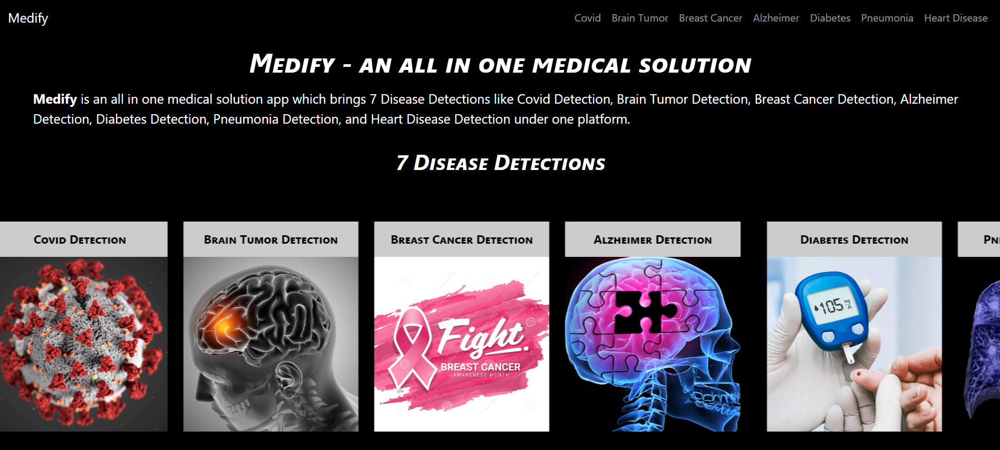

# Medify

# Medify - All-in-One Medical Solution



Medify is an all-in-one medical solution app that brings together seven disease detection modules under one platform. The app provides detection and diagnosis for Covid, Brain Tumor, Breast Cancer, Alzheimer, Diabetes, Pneumonia, and Heart Disease.

## Images


## Technologies Used

- HTML
- CSS
- Bootstrap
- JavaScript
- Python (Flask)

## Features

- Automatic Sliding: The app showcases the disease detection modules in a sliding carousel with automatic animation. The slides cycle through different disease detection options.

- Responsive Design: The user interface is responsive, ensuring an optimal viewing experience on various devices, including desktops, tablets, and mobile phones.

- Hover Pause: The automatic slide animation pauses when the user hovers over the carousel, allowing easy interaction and exploration of the detection options.

## Installation

1. Clone the repository:

```bash
git clone https://github.com/your-username/medify.git

